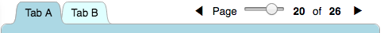

## curvy-tabs-pager

Injects a user control for controlling paged tab bar content:



The main tab (typically the first tab) contains an `<iframe>` element that hosts the pages. Each page may contain `<div>`s with markup for other tabs with `<iframe>` elements to create the effect of paging a whole set of tabs in parallel. Tabs with no matching `<div>` are hidden, hence “conditional tabs.”

### Synopsis
#### Paging one tab with other tabs static
```html
<div id="page-panel" style="position:absolute; top:48px; right:24px;"></div>
<div class="curvy-tabs-container">
  <!-- The main tab is always visible and has an iframe with no src -->
  <div style="background-color:lightblue" name="Tab A">
    <iframe></iframe>
  </div>
  <div class="curvy-tabs-conditional" style="background-color:lightcyan" name="Notes">
    I am static content.
  </div>

</div>
```
Instantiate the pager:
```js
var myPager = new CurvyTabsPager(pagerContainer, tabbedContent, tableOfContents, startPage, subfolder);
```
* Injects a `<style>` element into `<head>` (styles user control, stretches `<iframe>` to fit tab content area);
* injects the user control markup into the the given container; and
* wires it up.

Use `myPager.page(pageNumberOrName)` to programmatically switch between pages.

#### Paging multiple tabs in parallel
```html
<div id="page-panel" style="position:absolute; top:48px; right:24px;"></div>
<div class="curvy-tabs-container">
  <!-- The main tab is always visible and has an iframe with no src -->
  <div style="background-color:lightblue" name="Tab A">
    <iframe></iframe>
  </div>

  <!-- start: conditional tabs, initially hidden by the CSS class, typically src'd to a blank html file -->

  <div class="curvy-tabs-conditional" style="background-color:lightcyan" name="Tab B">
    <iframe src="blank.html"></iframe>
  </div>

  <div class="curvy-tabs-conditional" style="background-color:lightgreen" name="Tab C">
    <iframe src="blank.html"></iframe>
  </div>

  <!-- end: conditional tabs -->
</div>
```
Conditional tabs can be `src`-less (or sourced with `about:blank`) but more typically would source a local `blank.html` that `<link>`s to a local CSS stylesheet to style the page content:
```html
<!DOCTYPE html>
<html lang="en">
<head>
  <meta charset="UTF-8">
  <link rel="stylesheet" href="myPageContentStylesheet.css">
</head>
</html>
```
Markup for conditional tabs is found in named divs within the main page’s markup:
```html
...
<div class="curvy-tabs-conditional" name="Tab B">
    This is markup for Tab B!
</div>
...
```
Because there is no `<div class="curvy-tabs-conditional" name="Tab C">` in the main page’s markup, Tab C is hidden.

### Description
Creates a user control which it injects into the given `pagerContainer` element.
This lets the user navigate pages which are displayed in multiple tabs of a `CurvyTabs` tab bar (given in the `tabbedContent` parameter).
The page filenames are given in the `tableOfContents` list, prefixed with the path given in `subfolder`.

#### User interface control
The paging user control features:
* prev and next icons;
* a range control (slider);
* displays page number as "Page m of n"; and
* listeners for `ArrowLeft` and `ArrowRight` keydown events.

#### Pages
The first page is loaded into the _main tab,_ the first visible tab with an `<iframe>`.
If given in the `startPage` parameter, it may be either a number or a filename.
If the page is not found (or `startPage` is undefined or omitted), the first page listed in `tableOfContents` is loaded.

Pages loaded into the tab’s `<iframe>` must register with the parent window:
```js
parent.dispatchEvent(new CustomEvent('curvy-tabs-pager-register', { detail: { window: window }}));
```
You would typically include the above line in a common script loaded by all pages.

> Note: If you wish to maintain compatibility with IE 11, your script must also include the [`CustomEvent` polyfill](https://developer.mozilla.org/docs/Web/API/CustomEvent/CustomEvent#Polyfill).

#### Conditional tabs
As outlined above, all content for all conditional tabs is included in the main tab's markup. The main tab’s `<iframe>` is loaded by with the HTTP response. The _conditional tab(s),_ those tabs initially hidden with `display:none`, are loaded programmatically with the contents of hidden `<div class="curvy-tabs-conditional" name="Tab Name">...</div>` elements when found in the main tab’s DOM. Each such element is bound to a specific tab by the value of its `name` attribute, which must match a tab name. These tabs are then made visible; all other conditional tabs remain hidden.

### Dependency
The constructor takes a [`CurvyTabs`](#see-also) object (v2.3.1 or higher) as a required second parameter (`tabbedContent` in the synopsis above).

### Distribution
Published in two formats:

* An npm module published on the npm Registry (npmjs.org), for developer use at build time:
   ```js
   var CurvyTabsPager = require('curvy-tabs-pager');
   ```
* A script to be loaded by the client at run-time (sets global `CurvyTabsPager`), either of:
   ```html
   <script src="https://joneit.github.io/curvy-tabs/2.0.0/curvy-tabs.js"></script>
   <script src="https://joneit.github.io/curvy-tabs/2.0.0/curvy-tabs.min.js"></script>
   ```

### API

#### `CurvyTabsPager` constructor

Given a [`curvy-tabs`](https://github.com/joneit/curvy-tabs) instance:
```js
var tabbedContentContainer = document.querySelector('.curvy-tabs-container'); // or whatever
var tabbedContent = new CurvyTabs(tabbedContentContainer);
tabBar.paint();
```
The following instantiates a `CurvyTabsPager` objects:
```js
var pagerContainer = document.getElementById('page-panel'); // (or whatever)
var options = { // all members are optional (values are examples):
    toc: ['Synopsis.html', 'Description.html', 'See Also.html'],
    maxPage: 3, // file names are 1.html, 2.html, 3.html.; ignored if toc given
    startPage: 12, // may be page number or file name; omit for default (1)
    subfolder: 'content/', // omit or falsy or './' for no subfolder
    cookieName: 'page' // omit for default ('p'); falsy for no cookie
};

var myPager = new CurvyTabsPager(
    pagerContainer, // required
    tabbedContent,  // required
    options         // required; must have `toc` or `maxPage`
);
```

#### `CurvyTabs.prototype.getPageNum(pageNumberOrName)` method

Accepts either:
* A 1-based integer page number (or string representation thereof); or
* A filename in the table of contents

Returns:
* Integer page number
* 0 if given integer is out of range **or** given filename not found in table of contents

Examples:
```js
myPager.getPageNum(2);  // returns 2
myPager.getPageNum('2');  // returns 2
myPager.getPageNum('99');  // returns 0 (out of range)
myPager.getPageNum('-3');  // returns 0 (out of range)
myPager.getPageNum('Description.html'); // returns 2 (not integer but found in ToC)
myPager.getPageNum('Splat.html'); // returns 0 (not integer AND not found in ToC)
myPager.getPageNum('2.5');  // returns 0 (not integer AND not found in ToC either)
```

#### `CurvyTabs.prototype.page(pageNumberOrName, subfolder)` method

To go to a page programmatically:
```js
myPager.page(2);  // go to 2nd page (1-based)
myPager.page('Description.html'); // also goes to 2nd page
```

This method performs the following actions:
* Navigates iframe to the new page
* Displays new page number
* Disables previous page icon if first page
* Disables next page icon if last page
* Repositions range control

Fails silently if page does not exist.

#### `CurvyTabsPager.version` static property

Contains the version string `2.0.0` (major.minor.patch with no leading `v`).

####  static property

If you want to change the stylesheet that gets injected into `<head>`.

#### `CurvyTabsPager.stylesheet` and `CurvyTabsPager.html` static properties

The stylesheet and the markup to be injected may be overridden if desired by setting these static properties before instantiation.

## See Also
* `curvy-tabs` ([npm](https://npmjs.org/package/curvy-tabs), [github](https://github.com/joneit/curvy-tabs))

## Version History
* `2.0.0` (9/12/2018)
   * Removed `toc`, `startPage`, and `subfolder` instantiation parameters in favor of a single `options` object parameter with those keys
   * Add new instantiation option `option.maxPage` which can be given in place of `options.toc` in which case file names are the page numbers themselves (1.html, 2.html, _etc._)
* `1.0.0` — Initial release (9/11/2018)
